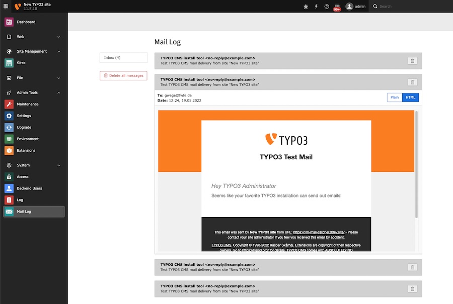

# Mail Catcher

This TYPO3 extension adds a backend module to view emails that were send to file.



## Installation

```
composer require xima/xima-typo3-mailcatcher
```

## Configuration

No extension configuration needed!

To prevent TYPO3 from sending emails, change the transport to `mbox` (see official [TYPO3 Mail-API](https://docs.typo3.org/m/typo3/reference-coreapi/main/en-us/ApiOverview/Mail/Index.html#mbox)). This way TYPO3 writes the outgoing emails to a log file that you can specify via `transport_mbox_file`. The path musst be absolute.

```
$GLOBALS['TYPO3_CONF_VARS']['MAIL']['transport'] = 'mbox';
$GLOBALS['TYPO3_CONF_VARS']['MAIL']['transport_mbox_file'] = \TYPO3\CMS\Core\Core\Environment::getProjectPath() . '/var/log/mail.log';
```
