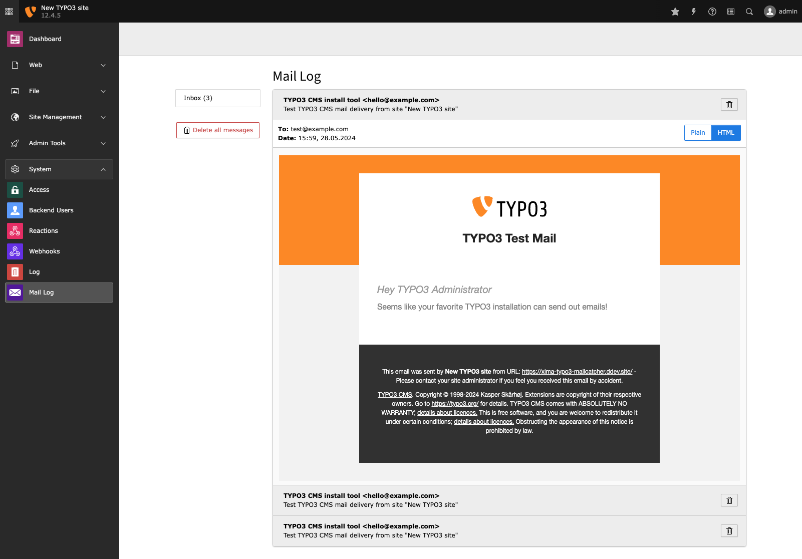

<div align="center">


# TYPO3 extension `xima_typo3_mailcatcher`

[](https://packagist.org/packages/xima/xima-typo3-mailcatcher)
[](https://extensions.typo3.org/extension/xima_typo3_mailcatcher)
[](https://packagist.org/packages/xima/xima-typo3-mailcatcher)
[](https://packagist.org/packages/xima/xima-typo3-mailcatcher)
[](https://github.com/xima-media/xima-typo3-mailcatcher/actions/workflows/tests.yml)
[](https://codecov.io/gh/xima-media/xima-typo3-mailcatcher)

</div>

A TYPO3 extension that adds a backend module to view emails that were send to
file.



## Installation

```
composer require xima/xima-typo3-mailcatcher
```

## Configuration

No extension configuration needed!

To prevent TYPO3 from sending emails, change the transport to `mbox` (see
official [TYPO3 Mail-API](https://docs.typo3.org/m/typo3/reference-coreapi/main/en-us/ApiOverview/Mail/Index.html#mbox)).
This way TYPO3 writes the outgoing emails to a log file that you can specify
via `transport_mbox_file`. The path musst be absolute.

```
$GLOBALS['TYPO3_CONF_VARS']['MAIL']['transport'] = 'mbox';
$GLOBALS['TYPO3_CONF_VARS']['MAIL']['transport_mbox_file'] = \TYPO3\CMS\Core\Core\Environment::getVarPath() . '/log/mail.log';
```

## License

This project is licensed
under [GNU General Public License 2.0 (or later)](LICENSE.md).
